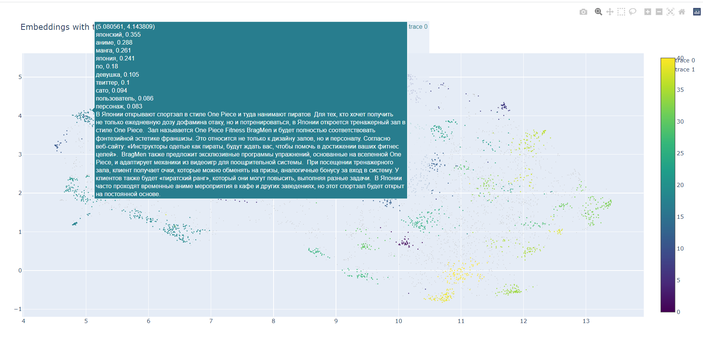

# Description

The notebook is provided clusterization and topic analysis of set of posts from telegram channel [@Hikikomori_on](https://t.me/hikikomori_on).

The following code is strongly relied on tutorial [Topic Modeling with BERT](https://towardsdatascience.com/topic-modeling-with-bert-779f7db187e6).

## Get Text Embeddings

[SentenceTransformers](https://www.sbert.net/index.html) - transformers trained to get embeddings for sentences and documents.
The model is trained to solve semantic similarity task

## Clusterize text

First of all we'll reduce the dimensionality of embeddings to speed up the clusterization process and to visualize obtained clusters, we'll use [UMAP](https://umap-learn.readthedocs.io/en/latest/) for it.

The clusterisation is made with [HDBSCAN](https://hdbscan.readthedocs.io/en/latest/index.html) as it can deal with clusters with different densities.

## Topic modelling

We'll present our texts as bag of words by preprocessing them in several steps:
1. Tokenize text to words
2. Get normal form of each word (lemmatize)

Then we'll glue up texts from the same clusters (our topics) and present each topic as long text of normalized words.

We'll build tf-idf vectors for topics and sort most important word from each topic

## Visualization of embeddings and topics keywords

We'll attach to each point of our dataset (to text) set of keywords related to its cluster for better visualization

